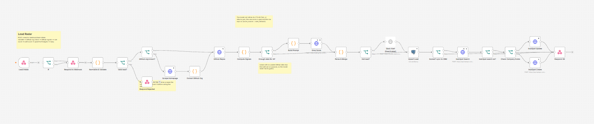
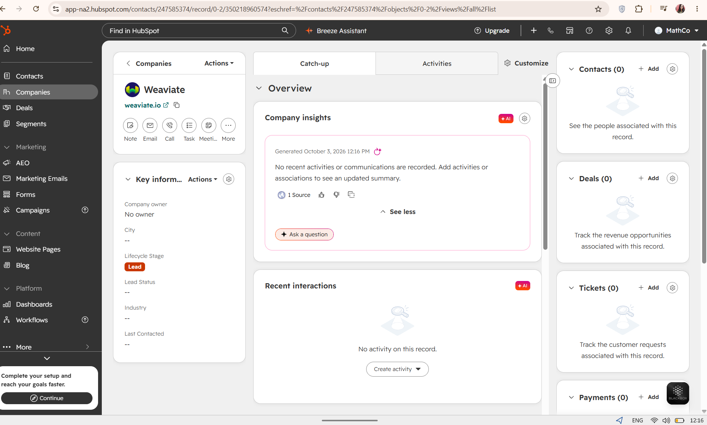

# Lead Radar




An n8n workflow that takes an inbound B2B lead, checks what the company actually builds on GitHub, scores fit from 1 to 5 with an LLM, and saves the result to Postgres. It was designed around what a GTM engineer at a developer-infrastructure company does: enrichment, scoring, hygiene, and keeping the outbound engine running without manual work.

The ICP is set for Unikraft (infrastructure, serverless, sandboxed compute). It lives in two clearly marked blocks (`nodes/02_signals.js` and `nodes/03_build_prompt.js`), so you can retarget it for any product.

## How it works

```
POST /webhook/lead-intake
  -> Normalize & Validate     clean domain, derive GitHub org, check email, flag freemail
  -> Valid?                   no: reply 422 with the reasons
  -> GitHub org known?        no: Scrape Homepage -> Extract GitHub Org (links must match the company name
                              or domain; otherwise the domain-derived guess is used, github_source = domain_hint)
  -> GitHub Repos             public repos via REST API (timeout, never throws on 404/403)
  -> Compute Signals          active repos, stars, languages, keyword hits, rule score 0-100 -> tier 1-5
  -> Enough data for AI?      no GitHub data: skip the LLM so it never has to guess
  -> Build Prompt -> Claude or Groq Score (3 retries)
  -> Parse & Merge            tolerant JSON parsing, range checks, grounding check, fallback to rules
  -> Hot lead?                score 4+: Slack alert (node ships disabled)
  -> Upsert Lead              Postgres, keyed on domain, so re-sends update instead of duplicating
  -> Scored?                  only scored leads go to HubSpot
  -> HubSpot Search -> Create or Update   company matched on domain; custom properties must exist (below)
  -> Respond OK               returns the lead plus stored (Postgres) and crm (created/updated/skipped/error)
```

A HubSpot failure never blocks the reply. `crm` is `error` and `crm_error` carries HubSpot's message.

A second workflow (`error-handler.json`) logs failed executions to a `workflow_errors` table.

## Design decisions worth knowing

- **Rules and LLM both score.** The rule score is a free baseline and the fallback if the model is down or returns junk. When the two differ by 2+ points the lead is flagged `needs_review` rather than trusted blindly.
- **No data, no guess.** Companies with no public GitHub org get status `no_github_data`, not a made-up score. Rate limits or network errors get `needs_retry` and a null score, so a temporary failure never looks like "bad lead".
- **Grounded openers.** Any number in a generated cold-email line must appear in the facts sent to the model, otherwise the opener is dropped.
- **Code lives in files.** The Code-node scripts are in `nodes/` so they can be tested and diffed. `workflows/build_workflow.py` inlines them into the importable JSON.
- **Idempotent writes.** Same domain twice updates the row.

## Run it

Needs Docker, a Groq or Anthropic API key, and ideally a GitHub personal access token (unauthenticated GitHub allows only 60 requests/hour).

```bash
cp .env.example .env            # set both secrets
docker compose up -d
python3 workflows/build_workflow.py --github-auth   # or without the flag for anonymous GitHub
```

1. Open http://localhost:5678 and create the owner account.
2. Credentials, using exactly these names:
   - **Groq API key** (if using Groq): type Header Auth, name `Authorization`, value `Bearer <your key>`
   - **Anthropic API key** (if using Claude): type Header Auth, name `x-api-key`, value your key
   - **GitHub token** (only if you built with `--github-auth`): Header Auth, name `Authorization`, value `Bearer <token>`
   - **CRM Postgres**: host `postgres`, database `crm`, user `crm`, password from `.env`
3. Import `workflows/lead-radar.json` and `workflows/error-handler.json`.
4. In Lead Radar's settings, set **Error Workflow** to the error handler.
5. Optional: paste a Slack incoming webhook URL into the `Slack Alert` node and enable it.
6. Activate the workflow, then try one lead:

```bash
curl -s -X POST localhost:5678/webhook/lead-intake -H 'Content-Type: application/json' \
  -d '{"company":"Fly.io","domain":"fly.io","github_org":"superfly"}'
```

## HubSpot setup

The workflow writes three custom company properties: `devlead_score`, `devlead_reason`, `github_org`.
HubSpot does not dictate these names. You create them, and the workflow must use the same names. Without them HubSpot answers 400 `PROPERTY_DOESNT_EXIST`.

```bash
export HUBSPOT_TOKEN=pat-...        # private app: companies read/write + company schemas read/write
python3 scripts/hubspot_setup.py --check
python3 scripts/hubspot_setup.py
```

Then create a Header Auth credential named `HubSpot token` (`Authorization: Bearer <token>`). The script and the HubSpot nodes are tested against local mocks only, not a live HubSpot account.

## Choosing the LLM provider

The builder supports two providers. Pick one when you generate the workflow:

```bash
python3 workflows/build_workflow.py --provider groq --github-auth             # free tier, OpenAI-style API
python3 workflows/build_workflow.py --provider anthropic --github-auth        # Claude, needs API credit
python3 workflows/build_workflow.py --provider groq --model <model-id>        # override the default model
python3 workflows/build_workflow.py --provider groq --hide-keyword-hits       # experiment: hide rule signals from the model
```

**Groq setup**

1. Create a free account at console.groq.com and make an API key under API Keys.
2. In n8n create a credential of type **Header Auth** named exactly `Groq API key`: header name `Authorization`, value `Bearer <your key>`.
3. Check the key and list the models available to you:
   `curl -s https://api.groq.com/openai/v1/models -H "Authorization: Bearer $GROQ_API_KEY"`
4. Import the workflow built with `--provider groq`.
5. Run the eval slowly, because free tiers cap requests and tokens per minute: `python3 eval/run_eval.py --delay 8`. Check your limits at console.groq.com/settings/limits.

The default Groq model is `openai/gpt-oss-120b`. Model names change; if the API rejects it, pick one from step 3 and pass it with `--model`. State the model you used whenever you report results.

**`--hide-keyword-hits` experiment.** The keyword list is produced by the rule stage and can anchor the model — large GitHub orgs accumulate infrastructure keywords even when infrastructure is not their product. This flag removes `keyword_hits` from the facts sent to the model and has it judge from repo names, descriptions and top repos directly. Label a fresh holdout set before running either variant so the comparison is not inflated.

## Choosing the ICP (config files)

Everything that defines who counts as a good lead lives in one TOML file instead of being scattered through the scripts: keyword and language weights, score caps, tier cutoffs, the hot-lead threshold, the review gap, and the text that describes the ideal customer in the model prompt.

```bash
python3 workflows/icp_config.py config/icp.dev-infra.toml        # validate and summarise (Python 3.11+)
python3 workflows/build_workflow.py --provider groq --github-auth --icp config/icp.dev-infra.toml   # --out-dir DIR to write elsewhere
```

To target a different product: copy `config/icp.dev-infra.toml`, edit it, validate it, rebuild, and re-import the workflow. The settings are written into the workflow at build time, so a change needs a rebuild; nothing is read at run time. The loader rejects unknown keys, out-of-range numbers and cutoffs that are not strictly increasing, so a typo fails the build instead of silently doing nothing.

Each scored lead carries an `icp` field such as `dev-infra@06d5dbab` (name plus a hash of every value that affects scoring), and `run_eval.py` writes it to the `icp` column of the results file. That ties every results file to the exact configuration that produced it.

`config/icp.dev-security.toml` is a second, **untested** example (supply-chain security tooling). It exists to show the retargeting mechanism, not to claim accuracy. A config can change weights and wording, but it cannot make GitHub informative for buyers who do not build software, which is why the next step adds more signals.

**This refactor changes no behaviour.** `tests/golden/pre_config_behavior.json` stores inputs and outputs recorded from the scripts as they were before the config existed, with a frozen clock, and the default config must reproduce them exactly: rule scores, signals, prompts (byte for byte) and parser results. Before committing, I also ran the old and new scripts side by side on 6,636 randomly generated inputs (3,000 for scoring, 636 for prompts, 3,000 for the parser) and found no difference in any output field. The model's answers still vary from run to run, so compare two configs with several runs each, not one.


## Tests and evaluation

```bash
node --test tests/test_nodes.js      # 37 unit tests for the Code-node scripts
```

To measure the scorer, label your own data. `data/leads.csv` has 35 real companies plus 5 deliberately dirty rows. Fill `human_score` (1 to 5) for each company yourself, from your own judgment of Unikraft's ICP, then:

```bash
python3 eval/run_eval.py --url http://localhost:5678/webhook/lead-intake
```

It prints exact agreement, within-one agreement, mean error, hot-lead precision and recall (score 4+), Spearman correlation and a confusion matrix, for the final score, the LLM alone, and the rules alone. That comparison shows whether the LLM step earns its cost. Report whatever it says, with the sample size.

**Holdout set.** `data/holdout.csv` has 30 companies that are not in `data/leads.csv`, shuffled so the order gives nothing away. The rule for using it: label every row first, using the same ICP as the 33 above, without looking at any pipeline output. Run each version of the pipeline on it once and do not tune against it. Comparing versions on this file is what keeps improvements honest, because the original 33 have already been seen.

```bash
python3 eval/run_eval.py --leads data/holdout.csv --out eval/results_holdout_v1.csv --delay 8
python3 eval/ops_report.py eval/results_holdout_v1.csv --labeled-only --markdown
```

`ops_report.py` prints coverage, latency, tokens and (if you pass `--price-in` and `--price-out` in USD per million tokens) cost. It never guesses prices. Result files written before latency and token tracking existed show those sections as "not recorded".

**Coverage (measured on the frozen v1 run).** 33 of 35 real companies got a score (94%). The two without a score, Starbucks and Marriott, have no public GitHub org and were both labeled 1, so the data gap fell on companies that were not a fit anyway. This is a favourable list: it is mostly technology companies, and a real inbound list would have far more companies with no GitHub presence. GitHub is one signal, and measuring how often it is missing is the first thing to check before trusting the score on a new list.

## End-to-end test without any keys

`tests/e2e/` runs the real workflow inside a real n8n, with small local mock servers standing in for GitHub and Claude. It covers a strong fit, a weak fit, a missing GitHub org, a rate limit, junk from the model, a model outage, a messy URL, and invalid input.

```bash
node tests/e2e/mock_servers.js &
python3 workflows/build_workflow.py --github-auth
python3 tests/e2e/patch_workflow.py workflows/lead-radar.json /tmp/e2e.json
n8n import:workflow --input=/tmp/e2e.json && n8n publish:workflow --id=leadRadarE2E00001 && n8n start
python3 tests/e2e/run_e2e.py
```

## Evaluation results

Labels were applied by a single person to 33 companies (out of 40 test rows; 4 had no public GitHub org and 3 were deliberately invalid). The prompt was not tuned toward these labels. Two runs of the same pipeline on the same 33 companies gave 55% and 64% exact agreement, demonstrating the non-determinism of the LLM step (the table below shows the frozen first run). Numbers should be read as suggestive, not proof, at n=33.

*Run details:* Evaluated Sept 30, 2026. Model: `openai/gpt-oss-120b` (max_tokens: 1024). Prompt version: `nodes/03_build_prompt.js` at commit `bb96cf3`.

| Scorer | Exact | Within 1 pt | MAE | Hot-lead precision | Hot-lead recall | Spearman |
|--------|-------|-------------|-----|--------------------|-----------------|----------|
| LLM (Groq `openai/gpt-oss-120b`) | **55%** | **91%** | **0.61** | **0.83** | **0.95** | **0.76** |
| Rules only | 36% | 70% | 1.12 | 0.63 | 0.95 | 0.49 |

All figures are for n=33. Hot lead = score 4 or 5. LLM fallbacks to rules: 0 (every lead with GitHub data got a valid LLM score).

*Token Usage (measured on this 33-company run):* Averaged 564 input tokens and 442 output tokens per LLM call. The 442 output tokens include the model's reasoning, which is a useful detail for cost estimations.

### Holdout results (n=30, untuned)

Companies in this set were chosen because they have public GitHub orgs, so coverage (30/30) says little about real inbound lists. Exact agreement with my labels was 67% (20/30, roughly 49% to 81% at 95% confidence). This set is dominated by clear fits and clear non-fits (24 of 30 labeled 1 or 5), so it is not directly comparable with the 55% on the first 33 companies. Median latency was 3.5s per lead (p95 8.7s) when sent one at a time; at the pacing needed for Groq's free tier, 1,000 leads would take roughly 2.5 hours. 

*Rules-only comparison (n=30):* The LLM scored 67% exact match (87% within 1 pt, 0.89 hot-lead precision/recall). The baseline rules-only logic scored 50% exact match (63% within 1 pt, 0.62 hot-lead precision, 1.00 hot-lead recall). This confirms the LLM step provides a massive accuracy improvement over the basic rules.


**Known gaps.** The three largest misses are Siemens, SAP and Tailscale, where the LLM scored 5 against labels of 2, 2 and 3. In each case the model's stated reason quotes the `keyword_hits` list almost verbatim — that list is produced by the rule stage, and large GitHub orgs accumulate those keywords even when infrastructure is not their product. Hiding `keyword_hits` from the model and having it judge from repo names and descriptions directly is a better experiment than patching the prompt. See `--hide-keyword-hits` above.

The upward bias on label-4 companies (all 7 scored 5) may partly reflect the labels: HashiCorp, Docker and Deno are plausibly 5s. Since both 4 and 5 count as hot, the practical impact is low.

### HubSpot and scrape paths (mocked)

`tests/e2e/mocks_hubspot_homepage.js`, `patch_workflow_hubspot.py` and `run_hubspot_cases.py` run the workflow in n8n against fake HubSpot and fake homepages (Postgres replaced by a stub). They cover create, update, a HubSpot 400, a Postgres failure, an unscored lead, and the scrape cases.

## Status of this build

| Part | State |
|---|---|
| Code-node logic | 37 unit tests pass |
| Eval metric maths | checked against hand-worked examples |
| Import and run in n8n 2.41.3 | both workflows import and run; webhook, GitHub fetch, LLM call, Postgres upsert all verified live |
| Postgres schema and upsert | tested against Postgres 16; repeat domains update the existing row |
| Error-handler workflow | imports and activates |
| Live GitHub and Groq calls | verified on 33 leads; 0 parse errors, 0 LLM fallbacks to rules |
| HubSpot sync | run in n8n 2.35.7 against a mock HubSpot only; no live HubSpot call yet |
| Homepage scrape | unit tests and mock-page runs only; never evaluated on real sites |
| Accuracy numbers | frozen above; prompt not tuned to labels |

## How to deploy
To deploy this project, you will need your own keys for GitHub, Groq, and HubSpot.

1. Copy .env.example to .env and add your tokens:
   - GITHUB_TOKEN: A GitHub Personal Access Token (public access only)
   - GROQ_API_KEY: A Groq API key
   - HUBSPOT_TOKEN: A HubSpot Private App token (with companies read/write schemas)
2. Run docker compose up -d to start the Postgres and n8n services.
3. Import the workflows/lead-radar.json and workflows/error-handler.json into n8n.
4. Re-authenticate the GitHub, Groq, and HubSpot nodes with your tokens via Header Auth credentials.

## Limitations
- **Sequential processing:** The webhook processes leads one at a time sequentially.
- **Rate limits:** The Groq API is subject to rate limiting which may cause fallbacks.
- **Security:** The webhook currently has no authentication, meaning anyone can call the endpoint.
- **Scraper limitations:** The GitHub scraper only fetches HTTPS pages and may fail on captchas or complex redirects.

## Hit Rate
Measured scraper hit rate for missing GitHub orgs: **33.3%** (1/3 successful fallbacks).
